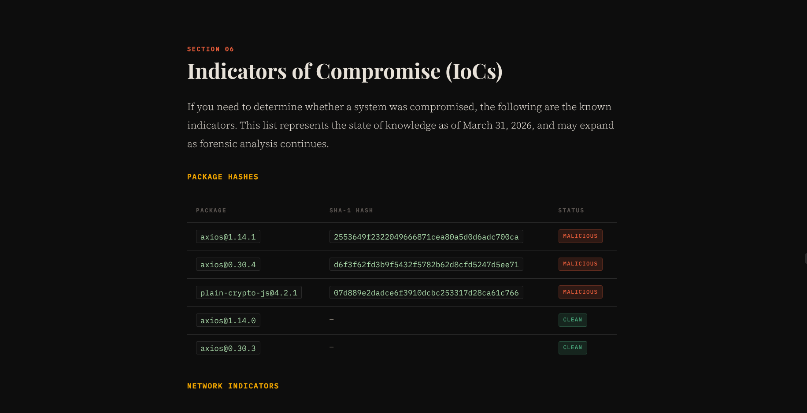

This article explores a fictional but highly realistic NPM supply-chain attack where a compromised Axios release turns a trusted dependency into an attack vector.

It breaks down how a stolen token, a malicious dependency, and an automatic postinstall script could expose developers, CI/CD pipelines, and production secrets in only seconds.

The piece highlights the fragile trust behind modern open-source ecosystems and why practices like lockfiles, token rotation, and secure publishing workflows matter.

> [!NOTE] Demo
> You can read the demo here: [The Axios Attack](https://rayennaat.github.io/axios-attack/)

