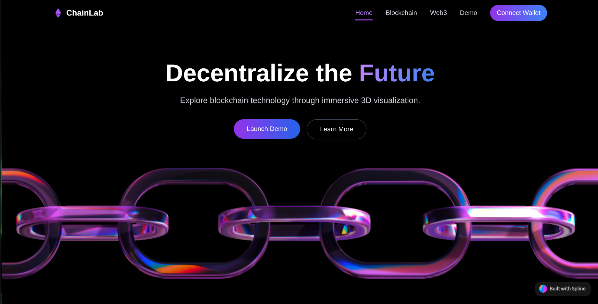
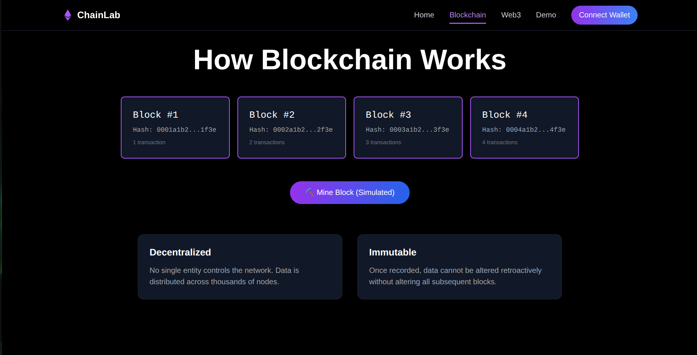
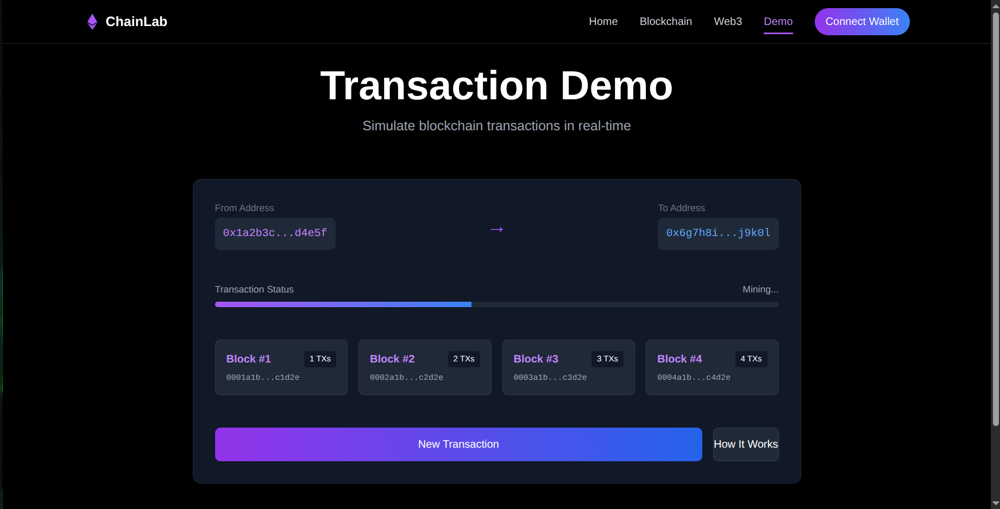
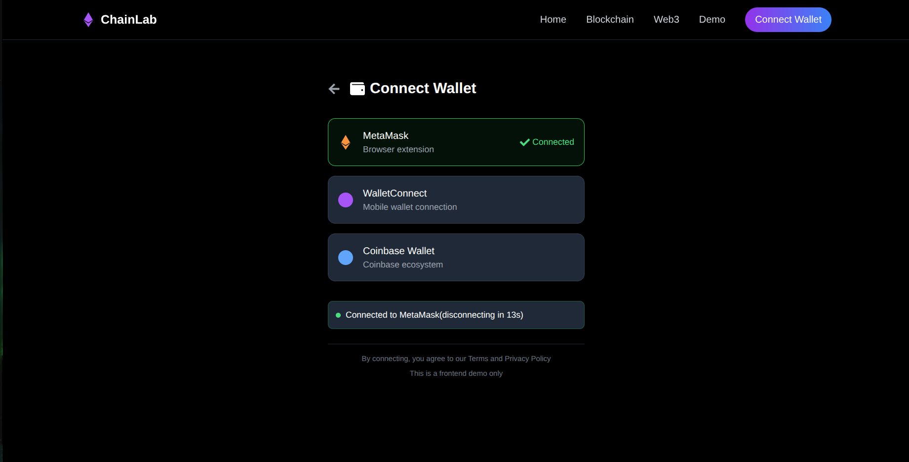

ChainLab is a React web app designed to introduce blockchain and Web3 concepts in a simple, visual, and interactive way.

Instead of presenting blockchain as something complicated or intimidating, the website uses a dark futuristic interface, smooth animations, and 3D visuals to make the experience more engaging.

> [!NOTE] Live Demo
> You can visit the project here: [ChainLab](https://chainbl0ck.netlify.app/)

The homepage presents the idea of decentralization with a strong visual identity, using a 3D chain model to represent connection, trust, and the future of blockchain technology.

## Understanding Blockchain

The Blockchain section explains how blocks are connected together and introduces important ideas such as decentralization and immutability.

It also includes a simulated mining action, allowing users to interact with the concept instead of only reading about it.

## Transaction Simulation

The demo page simulates a blockchain transaction in real time.

It shows sender and receiver addresses, transaction status, blocks, and transaction counts, helping users understand how transactions can move through a blockchain network.

## Wallet Connection Flow

ChainLab also includes a mock wallet connection flow, where users can explore how wallets like MetaMask, WalletConnect, and Coinbase Wallet are usually presented in Web3 applications.

This part is frontend-only and made for demonstration purposes.

## Why This Project Matters

Overall, ChainLab is an educational frontend project that combines design, interaction, and blockchain concepts.

It was built to make Web3 feel easier to understand, while also showing how modern React interfaces can turn technical ideas into a more enjoyable learning experience.
