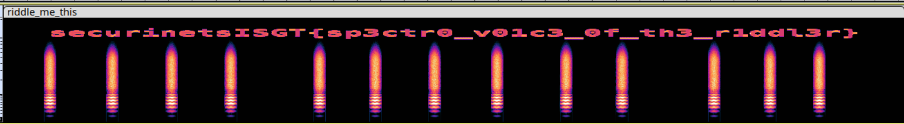
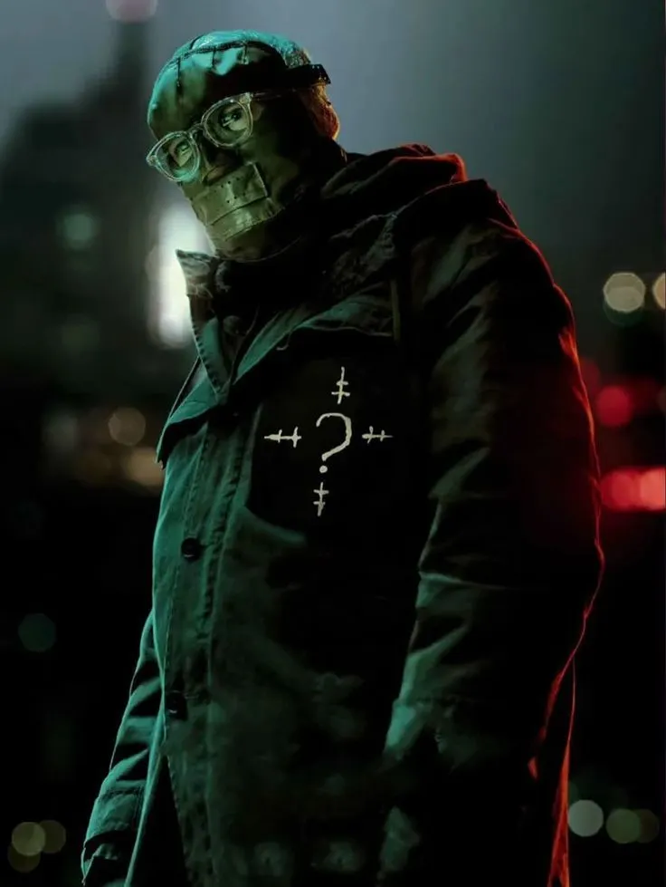
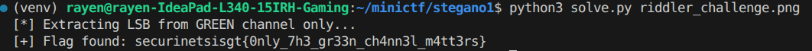
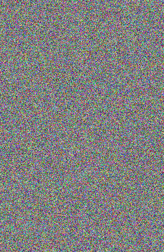
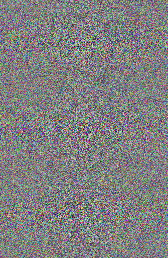
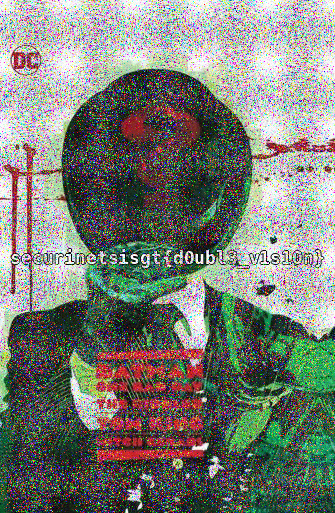

This post collects three Riddler steganography challenges in increasing difficulty:

1. **Warmup** - an audio spectrogram challenge.
2. **So Green** - a green-channel LSB image challenge.
3. **Double Blind** - a two-image XOR challenge that requires alignment first.

## Warmup

## Challenge Description

The Riddler has sent us a recording. We can hear him, that slow and deliberate voice, reciting one of his riddles:

> "The more you take, the more you leave behind. What am I?"

But the answer he wants is not `footsteps`.

The real answer is hidden somewhere in the audio itself, in a place the human ear was never designed to reach.

> "His voice echoes at frequencies beyond human hearing."

Given file:

```text
riddle_me_this.wav
```

## Initial Approach

First, open the file and listen.

You hear a robotic voice reading a riddle. Nothing immediately sounds suspicious if you are only using your ears.

The solve lives entirely in the flavor text:

```text
frequencies beyond human hearing
```

That is a direct pointer to the **spectrogram**, a visual representation of an audio file's frequency content over time.

## Solution

Open `riddle_me_this.wav` in Audacity.

By default, Audacity shows the waveform view. Switch the track to spectrogram mode:

- Click the small dropdown arrow next to the track name in the top-left of the track.
- Select **Spectrogram**.

The view changes, and the flag appears across the high-frequency band of the audio, like graffiti painted in sound.



## Flag

```text
securinetsisgt{sp3ctr0_v01c3_0f_th3_r1ddl3r}
```

---

## So Green

## Challenge Description

The Riddler has left us a portrait. A gift. A taunt.

He wants us to see him, truly see him, but only those who understand his nature will find what is hidden beneath the surface.

> "He only sees in green."

Given file:

```text
riddler.png
```



## Initial Approach

The first instinct with any image steganography challenge is to run standard tools.

Start with `zsteg`:

```bash
zsteg riddler.png
```

The output comes back with what looks like data, but decoding it gives garbage.

The same thing happens if we try `steghide`, check `strings`, or dump metadata with `exiftool`. Nothing useful appears.

This is intentional. The Riddler planted noise in the other channels to waste time.

## The Insight

Stop and read the flavor text:

```text
He only sees in green.
```

The flag is hidden using **LSB**, or Least Significant Bit, steganography, but only in the green channel of the RGB image.

Tools like `zsteg` often read all three channels together: red, green, and blue. When the real data only lives in one channel, the other two channels act like noise and corrupt the extracted bitstream.

So the fix is simple: isolate green and read only that channel.

## Solver Script

```python
import sys
from PIL import Image


def bits_to_str(bits: list) -> str:
    """Convert a flat list of bits back to a string, stopping at null byte."""
    chars = []
    for i in range(0, len(bits), 8):
        byte_bits = bits[i:i + 8]
        if len(byte_bits) < 8:
            break

        byte = 0
        for b in byte_bits:
            byte = (byte << 1) | b

        if byte == 0:
            break

        chars.append(chr(byte))

    return "".join(chars)


def extract_flag(image_path: str) -> str:
    img = Image.open(image_path).convert("RGB")
    width, height = img.size

    bits = []
    for y in range(height):
        for x in range(width):
            r, g, b = img.getpixel((x, y))
            bits.append(g & 1)

    return bits_to_str(bits)


if __name__ == "__main__":
    if len(sys.argv) != 2:
        print("Usage: python3 solve.py <stego_image>")
        sys.exit(1)

    print("[*] Extracting LSB from GREEN channel only...")
    flag = extract_flag(sys.argv[1])

    if flag:
        print(f"[+] Flag found: {flag}")
    else:
        print("[!] Nothing found. Wrong image or wrong channel?")
```

Run it:

```bash
python3 solve.py riddler.png
```

Output:

```text
[*] Extracting LSB from GREEN channel only...
[+] Flag found: securinetsisgt{0nly_7h3_gr33n_ch4nn3l_m4tt3rs}
```



## Flag

```text
securinetsisgt{0nly_7h3_gr33n_ch4nn3l_m4tt3rs}
```

---

## Double Blind

This writeup covers **Double Blind**, a steganography challenge built around combining two noisy images.

The challenge gives us two image files named `riddler_eye_left.png` and `riddler_eye_right.png`. Neither image reveals anything useful alone, but the flavor text strongly hints that the solution depends on aligning and combining them.

## Challenge Info

```text
Category: Steganography
Points: 300
```

Flavor text:

> "The blind eye sees nothing. But two blind eyes? That's a different story, detective. I've left you two portraits of myself. Neither one will tell you anything alone — I made sure of that. But together, if you know how to look... One small warning: things may appear slightly off. Align your vision before you look." — E. Nygma

## Recon

First, we run basic recon on both files:

```bash
file riddler_eye_left.png riddler_eye_right.png
identify riddler_eye_left.png riddler_eye_right.png
strings riddler_eye_left.png
strings riddler_eye_right.png
```

The `identify` output immediately reveals something important:

```text
riddler_eye_left.png  PNG 335x513
riddler_eye_right.png PNG 340x521
```

The two images have different dimensions.

We note this and move on. Both images look like pure random noise visually, with no structure and no visible text.

| Left eye | Right eye |
| --- | --- |
|  |  |

Running `strings` and `exiftool` on both images gives us nothing useful in the metadata.

## Reading the Flavor Text

Going back to the description, the wording gives us the path:

- `"Neither one will tell you anything alone"` means single-image tools are unlikely to help.
- `"Together, if you know how to look"` means the two images must be combined.
- `"Things may appear slightly off. Align your vision"` directly references the dimension mismatch found during recon.

Two noisy images that must be combined together points toward **XOR steganography**, one of the most common two-image combination techniques in CTFs.

## First Attempt: Naive XOR

We start with a quick XOR script:

```python
from PIL import Image
import numpy as np

a = np.array(Image.open("riddler_eye_left.png").convert("RGB"))
b = np.array(Image.open("riddler_eye_right.png").convert("RGB"))

result = np.bitwise_xor(a, b)
Image.fromarray(result.astype(np.uint8)).save("attempt1.png")
```

It crashes immediately:

```text
ValueError: operands could not be broadcast together
with shapes (513,335,3) (521,340,3)
```

This confirms what the `identify` output already showed: the dimensions do not match.

The flavor text said to **align your vision**, and this is exactly what we need to do.

## The Fix: Align Then XOR

We resize `riddler_eye_right.png` to match `riddler_eye_left.png`, then XOR the pixels.

## Solver Script

```python
from PIL import Image
import numpy as np

# Load both images
img_a = Image.open("riddler_eye_left.png").convert("RGB")
img_b = Image.open("riddler_eye_right.png").convert("RGB")

print(f"Left  size: {img_a.size}")   # 335x513
print(f"Right size: {img_b.size}")   # 340x521, mismatch

# Step 1: Align by resizing right to match left
img_b_resized = img_b.resize(img_a.size, Image.LANCZOS)
print(f"Right resized to: {img_b_resized.size}")  # 335x513

# Step 2: XOR pixel by pixel
a = np.array(img_a)
b = np.array(img_b_resized)
result = np.bitwise_xor(a, b)

# Step 3: Save result
result_img = Image.fromarray(result.astype(np.uint8))
result_img.save("solved.png")
print("[+] Done. Check solved.png")
```

## Output

```text
Left  size: (335, 513)
Right size: (340, 521)
Right resized to: (335, 513)
[+] Done. Check solved.png
```

Opening `solved.png` reveals the Riddler artwork with the flag clearly written across it:



```text
securinetsisgt{d0ubl3_v1s10n}
```

## Key Takeaways

- Both images look like pure noise individually, so no single-image tool will find the flag.
- The dimension mismatch was visible from the first `identify` command. Recon always pays off.
- The flavor text was a fair and direct hint. `"Align your vision"` maps literally to resizing before XORing.
- XOR is a standard two-image steganography technique, and everything else follows from the error message and the flavor text.
