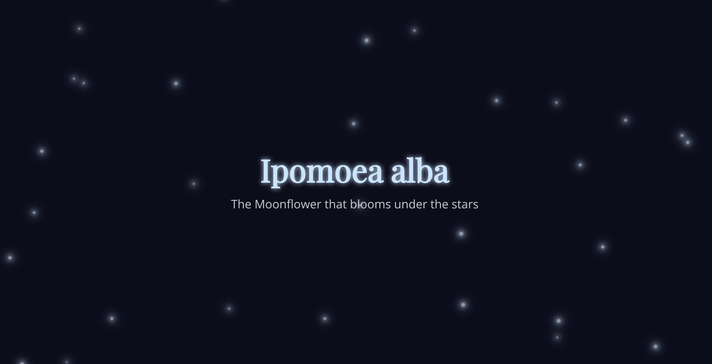
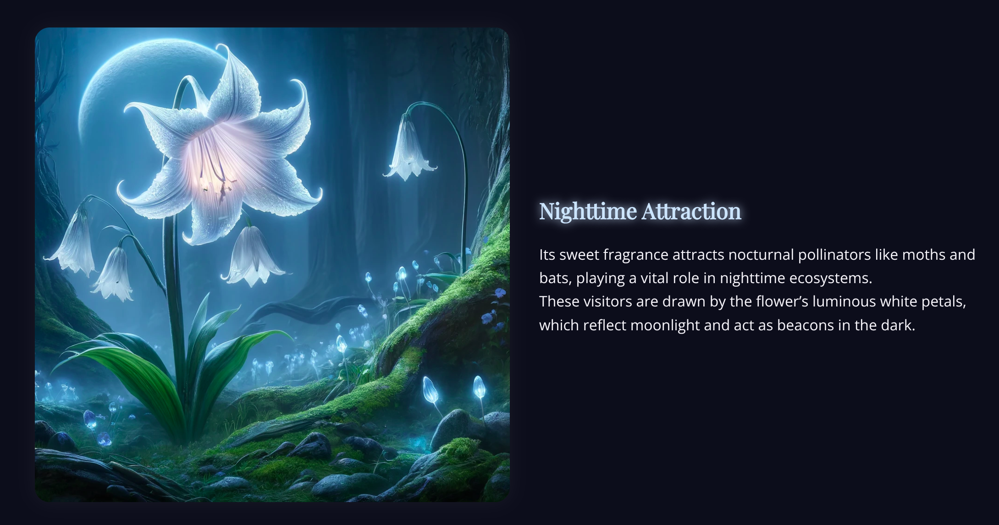

This website may not be the most beautiful, the most advanced, or the most technically impressive, but it is the most precious one to me.

> [!NOTE] Live Website
> You can visit the project here: [Ipomoea alba](https://rayennaat.github.io/7chich/)

## The Flower Behind the Idea

**Ipomoea alba**, commonly known as the **Moonflower**, is a beautiful night-blooming plant famous for its large white flowers and magical evening appearance.

Unlike many flowers that open during the day, the Moonflower reveals its beauty at dusk, glowing softly under moonlight and creating a peaceful, dreamlike atmosphere.

## A Night Garden Feeling

This climbing plant grows quickly and can cover fences, walls, or garden structures, making it a wonderful choice for night gardens.

Its bright white petals and sweet fragrance attract nocturnal pollinators such as moths and bats. Because of this, Ipomoea alba is not only decorative, but also part of the nighttime ecosystem.

## My Design Direction

For my website, I wanted to capture the mysterious and elegant side of this flower: a plant that feels connected to the moon, stars, and night.

Through dark colors, glowing text, soft images, and a calm layout, the design reflects the silent beauty of the Moonflower.

## Why This Project Matters

This project matters to me because it is personal. It is not only a website about a flower, but also a small design piece that helped me express a specific mood: quiet, bright, and alive in the dark.

That is why this website is precious to me.
