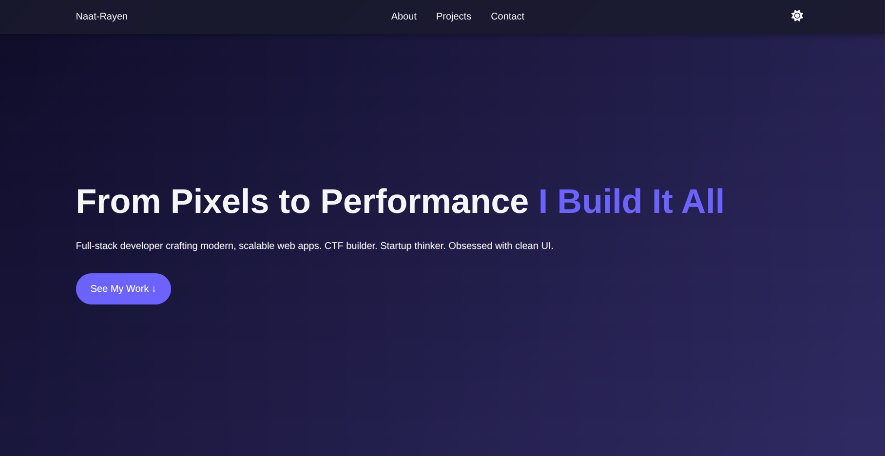
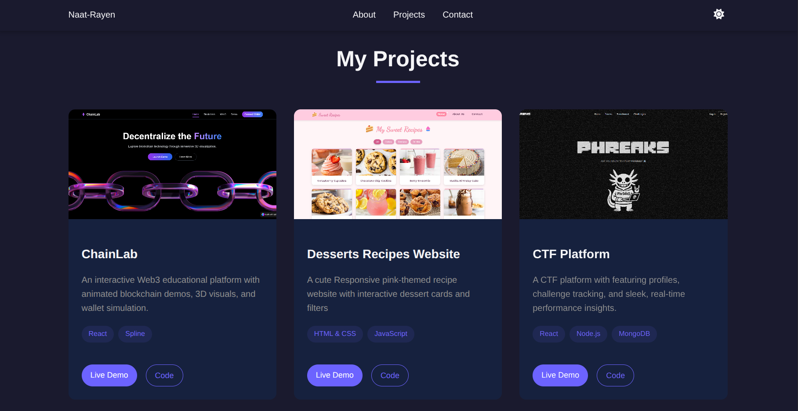

This project is a responsive personal portfolio website built to showcase my work through a clean and structured frontend interface.

It includes a hero section, about section, toolkit and skills area, project cards, and a contact form, all organized in a smooth single-page layout.

> [!NOTE] Live Demo
> You can visit the project here: [Personal Portfolio Website](https://rayennaat.github.io/Portfolio/)

## Frontend Structure

Technically, the website focuses on reusable UI sections, consistent spacing, responsive layouts, and a modern dark theme.

It also includes navigation links, a theme toggle, project preview cards, skill categories, and social/contact links.

## Why This Project Matters

The portfolio was designed to be simple, readable, and easy to expand.

It works as a solid base for displaying future projects, improving personal branding, and practicing modern frontend structure.

