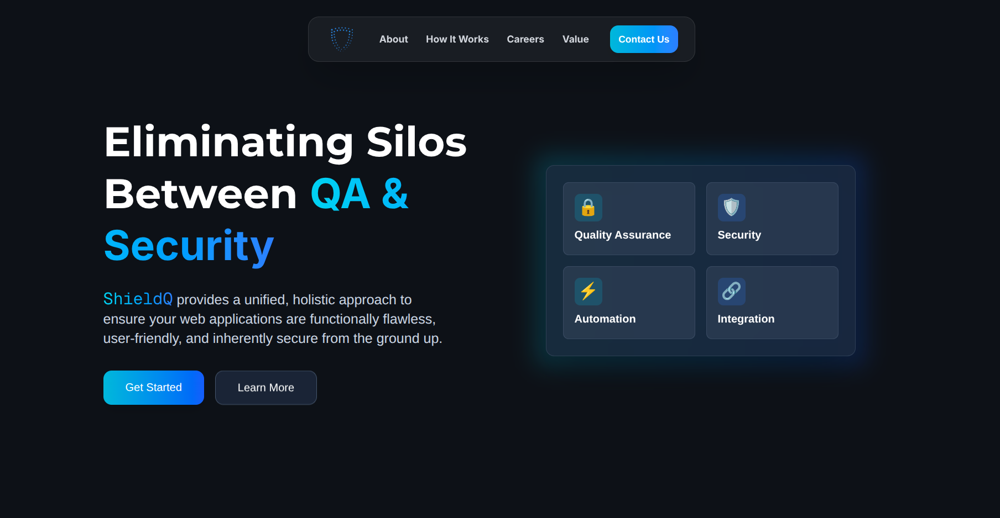
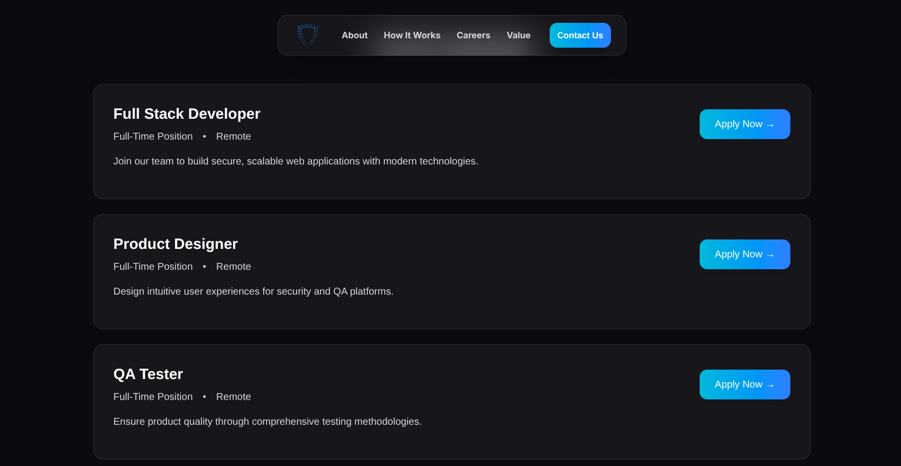
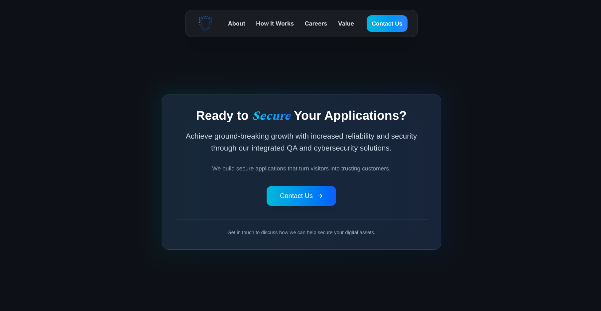

ShieldQ is a startup-style website built around one idea: modern web apps should be reliable, usable, and secure from the start.

It combines Quality Assurance and Cybersecurity into one clean brand experience, using a dark interface, blue gradient accents, and a professional layout to make the startup feel serious and trustworthy.

> [!NOTE] Live Demo
> You can visit the project here: [ShieldQ](https://dulcet-bavarois-2f6af4.netlify.app/)

## Quality and Security Together

The main message of ShieldQ is that testing and security should not feel like two disconnected processes.

The services section presents QA engineering, test automation, security operations, performance engineering, continuous testing, and CI/CD integration as parts of the same workflow. This makes the site feel useful for SaaS startups, agencies, e-commerce platforms, and teams that want stronger digital products.

## Careers and Team Growth

The careers section gives the project a more realistic company feel. Roles like Full Stack Developer, Product Designer, and QA Tester make ShieldQ look like a growing technical team rather than just a landing page.

## Building Trusted Products

The final call-to-action keeps the message simple: build products that users can trust. ShieldQ is a small frontend project, but it presents a strong startup identity around quality, security, and modern web delivery.
